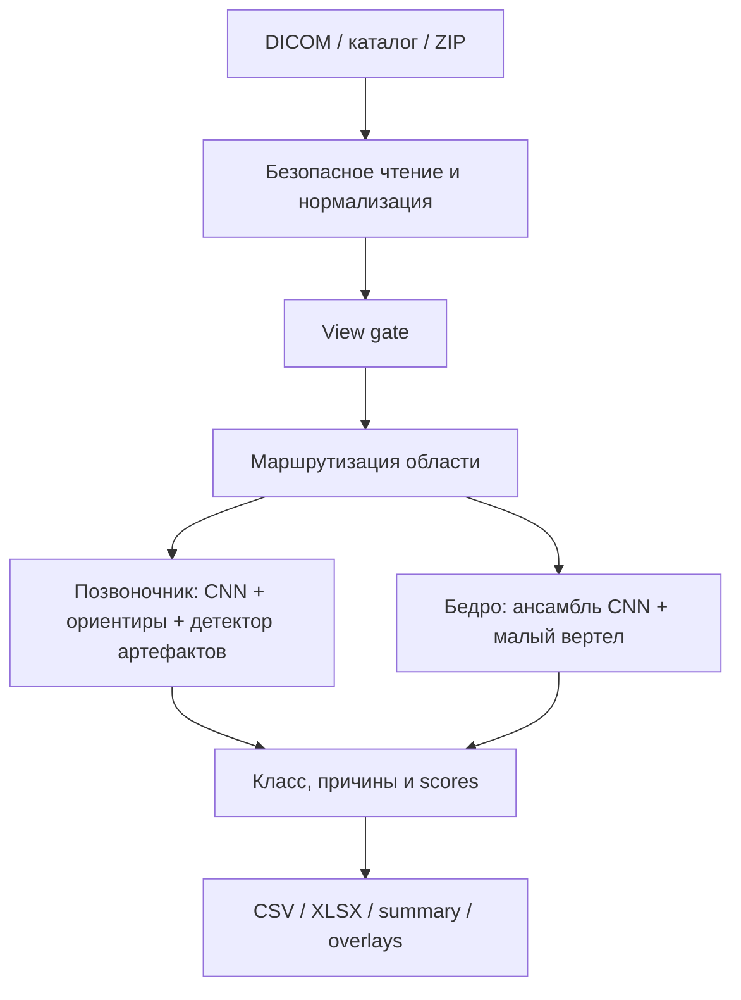

# Документация проекта DXA QC

Этот документ — единая техническая документация проекта. В нём без обязательных
переходов в другие файлы собраны назначение, архитектура, технологический стек,
установка, локальный запуск, Docker-развёртывание, HTTP API, воспроизводимость,
валидация, безопасность и известные ограничения. Остальные файлы в `docs/`
расширяют отдельные темы и сохраняют подробные исследовательские отчёты.

## 1. Назначение и границы

DXA QC — локальный исследовательский сервис контроля качества DICOM-снимков:

- поясничного отдела позвоночника;
- правого проксимального отдела бедра;
- левого проксимального отдела бедра.

Входом служит один DICOM, каталог или ZIP. Выход — CSV/XLSX, одна строка на
входной файл. Система определяет анатомическую область, бинарный класс качества
и одну или несколько причин нарушения:

```text
spine_scan_range
spine_axis_tilt
spine_artifact
hip_positioning
hip_roi_margins
```

Это прототип для хакатона, а не медицинское изделие. Итоговые метрики получены
на development OOF; независимой межцентровой клинической проверки нет.

## 2. Архитектура



Основные модули:

| Компонент | Файл | Ответственность |
|---|---|---|
| Публичный Python API | `src/dxaqc/api.py` | Создание predictor и пакетный анализ |
| CLI | `src/dxaqc/cli.py` | Аргументы, коды завершения, запись отчёта |
| Входы | `src/dxaqc/inputs.py` | Файл/каталог/ZIP, лимиты и защита от traversal |
| DICOM | `src/dxaqc/dicom_io.py` | Декодирование, MONOCHROME1, UID и pixel spacing |
| Пакетная обработка | `src/dxaqc/pipeline.py` | Изоляция ошибок файлов и дедупликация вычислений |
| Release-модель | `src/dxaqc/release_predictor.py` | Маршрутизация и итоговые правила решения |
| Bundle | `src/dxaqc/bundle.py` | Проверка manifest и SHA-256 моделей |
| Ориентиры | `src/dxaqc/landmarks.py` | Heatmap-модель и геометрические измерения |
| Артефакты | `src/dxaqc/artifacts.py` | Проволока/металл на позвоночнике |
| Малый вертел | `src/dxaqc/lesser_trochanter.py` | Признаки ротации бедра |
| Отчёт | `src/dxaqc/report.py` | Контракт CSV/XLSX и безопасная запись |
| HTTP API | `src/dxaqc/server.py` | Локальные `/health` и `/v1/batch` |

## 3. Технологический стек

| Слой | Технологии |
|---|---|
| Язык и окружение | Python 3.12, `uv`, `uv.lock`, Hatchling |
| Модели | PyTorch 2.14.0, torchvision 0.29.0, scikit-learn 1.9.1 |
| Обработка данных | NumPy, pandas, SciPy, OpenCV, Pillow |
| Медицинские изображения | pydicom, pylibjpeg, pylibjpeg-libjpeg |
| Отчёты | CSV, JSON, openpyxl для XLSX, Matplotlib для визуализаций |
| HTTP API | `http.server.HTTPServer` из стандартной библиотеки Python |
| Контейнеризация | Docker, `python:3.12.12-slim-bookworm`, CPU runtime |

Исследовательское окружение полностью фиксируется файлом `uv.lock`. Минимальный
CPU runtime закреплён в `requirements-runtime.txt`; PyTorch и torchvision для
Docker устанавливаются из официального CPU-индекса. Базовый инференс не требует
GPU: рекомендуются два CPU-потока, не менее 4 GiB RAM и дополнительное временное
место для распаковки больших ZIP.

## 4. Установка и локальный запуск

```sh
git clone https://github.com/Ravlennn/fatboost-dxa-qc.git
cd fatboost-dxa-qc
uv sync --frozen
```

Source-only проверка кода:

```sh
uv run python -m unittest discover -s tests -v
uv run python -m compileall -q src scripts tests
```

Для реального инференса отдельно установите проверенный model bundle в
`models/release/`, затем выполните:

```sh
uv run dxaqc doctor --model-dir models/release
uv run dxaqc -i /path/to/studies.zip -o outputs/result.xlsx \
  --model-dir models/release --details --scores --fail-on-error
```

Чистый Git-клон позволяет установить проект и запустить source-only тесты, но
не содержит приватные DICOM и release-веса. Отсутствие bundle не приводит к
скрытому переключению на фиктивную модель: команда завершится ошибкой.

## 5. Развёртывание в Docker

Перед сборкой в `models/release/` должны находиться `manifest.json` и все файлы,
перечисленные в manifest. Сборка и пакетный запуск:

```sh
sh scripts/build.sh
sh scripts/run.sh /absolute/studies.zip /absolute/results/result.csv
```

Контейнер запускается без сети, с read-only filesystem, двумя CPU, лимитом
памяти 4 GiB и отдельной временной файловой системой. Для передачи готового
образа на закрытую Linux x86_64 машину:

```sh
DXAQC_IMAGE=dxaqc:release-amd64 sh scripts/build.sh --platform linux/amd64
docker save dxaqc:release-amd64 -o dxaqc-release-amd64.tar
sha256sum dxaqc-release-amd64.tar > dxaqc-release-amd64.tar.sha256
```

На целевой машине:

```sh
sha256sum -c dxaqc-release-amd64.tar.sha256
docker load -i dxaqc-release-amd64.tar
docker run --rm -p 127.0.0.1:8080:8080 \
  --read-only --tmpfs /tmp:rw,nosuid,nodev,size=3g \
  --cpus=2 --memory=4g \
  dxaqc:release-amd64 serve --host 0.0.0.0 --port 8080
```

Порт контейнера слушает `0.0.0.0`, однако Docker публикует его только на
`127.0.0.1:8080` хоста. Поэтому API не доступен извне без явного изменения
сетевой конфигурации.

## 6. HTTP API

Локальный сервер запускается командой:

```sh
uv run dxaqc serve --model-dir models/release \
  --host 127.0.0.1 --port 8080 --threads 2
```

| Метод и путь | Назначение | Ответ |
|---|---|---|
| `GET /health` | Проверка готовности и идентификатора модели | JSON со `status` и `model_id` |
| `POST /v1/batch` | Анализ ZIP-пакета DICOM | JSON с `rows` и `summary` |

Пример запроса:

```sh
curl http://127.0.0.1:8080/health
curl -H "Content-Type: application/zip" \
  --data-binary @studies.zip http://127.0.0.1:8080/v1/batch > response.json
```

Для `POST /v1/batch` обязательны `Content-Type: application/zip` и
`Content-Length`; максимальный размер сжатого тела — 512 MiB. Основные коды:
`200` — пакет обработан, `400` — повреждённый или небезопасный ZIP, `413` —
превышен размер, `415` — неверный тип содержимого, `404` — неизвестный endpoint.
Ошибки отдельных DICOM возвращаются внутри результата и не прерывают весь
пакет. Сервер обрабатывает пакеты последовательно и не предоставляет
аутентификацию, поэтому по умолчанию должен оставаться доступным только на
localhost.

## 7. Контракт данных

Строгий отчёт содержит восемь колонок:

```text
path_to_study,study_uid,image_uid,anatomical_region,quality_class,violation_type,processing_status,time_of_processing
```

Правила:

- `quality_class=0` — нарушение не обнаружено;
- `quality_class=1` — обнаружено нарушение;
- `quality_unspecified` означает, что бинарная голова обнаружила брак, но
  конкретная причина не прошла порог;
- ошибка одного файла создаёт строку `Failure` и не прерывает весь пакет;
- одинаковые пиксели вычисляются один раз, но каждый входной файл сохраняет
  собственную строку;
- отсутствующие UID заменяются детерминированными техническими `2.25.*`;
- PatientName и PatientID в отчёт не экспортируются.

Непрерывные scores доступны с `--scores`. Они не заявлены как клинически
откалиброванные вероятности.

## 8. Модельный bundle

Runtime не скачивает веса. Каталог `models/release/` должен содержать
`manifest.json` и все файлы, перечисленные в `manifest.files`. Команда
`dxaqc doctor` проверяет:

- версию схемы;
- наличие каждого файла;
- SHA-256;
- ссылки на encoder, головы, пять checkpoints каждого hip-run;
- допустимость архитектур и порогов.

Минимальная проверка:

```sh
uv run dxaqc doctor --model-dir models/release
```

Отсутствие bundle является ошибкой конфигурации. Silent fallback на dummy-модель
в release-режиме запрещён.

## 9. Уровни воспроизводимости

Под «воспроизводимостью» в проекте различаются четыре уровня.

| Уровень | Что можно повторить | Дополнительные артефакты |
|---|---|---|
| Исходный код | Установка, импорт, source-only unit-тесты | Не нужны |
| Инференс | Те же модели и правила на новых DICOM | Проверенный `models/release/` |
| Финальная OOF-оценка | Таблицы из `FINAL_VALIDATION.md` | Приватные DICOM, labels/folds и сохранённые OOF/измерения |
| Обучение с нуля | Hip CNN, linear heads, ориентиры и export bundle | Приватные данные, внешние Arak/Pakistan, официальные ImageNet-веса |

Чистый Git-клон **не содержит** медицинские данные, release-веса и большую часть
`outputs/`. Поэтому он воспроизводит код и тесты, но не может сам по себе
повторить финальный инференс или численные метрики. Для точного повторения
необходим отдельный защищённый комплект артефактов.

## 10. Данные и provenance

### Приватная выборка организаторов

Ожидаемая структура:

```text
data/interim/train/Исследования/**
data/interim/test/Для теста/**
data/interim/image_labels.csv
data/interim/folds.csv
data/interim/dicom_index.csv
data/interim/local_provenance.json
```

Основная development-выборка: 100 исследований, 252 уникальных изображения,
249 изображений с меткой качества. Пять folds группируются по исследованию;
точные дубли и один study не должны пересекать folds.

`scripts/prepare_local_team_data.py` восстанавливает таблицы только из уже
проверенного annotation bundle (`labels_candidate.jsonl` и `quarantine.jsonl`).
Сам процесс получения этого bundle из исходной Excel-разметки в репозитории не
зафиксирован. Следовательно, для полного восстановления таблиц annotation
bundle должен поставляться отдельно вместе с его SHA-256.

### Внешние данные

- **Arak Bone Densitometry Center** — слабые метки анатомии и обучение
  ориентиров. Подробности: [`METHODS_AND_MODELS.md`](METHODS_AND_MODELS.md) и
  [`THIRD_PARTY.md`](THIRD_PARTY.md).
- **Pakistan DXA** — использовался в отдельных исторических/SSL-сериях, не как
  источник целевых QC-меток.
- **CGMH и другие plain X-ray наборы** — исследовательские auxiliary-задачи;
  их labels не считаются целевыми DXA QC labels.

Ни один внешний набор не включается в Git или release-архив. Перед новым
обучением необходимо повторно проверить условия лицензии источника.

## 11. Воспроизведение результатов

### 11.1 Source-only тесты

```sh
uv sync --frozen
uv run python -m unittest discover -s tests -v
```

Без `models/release/` bundle-интеграционные тесты пропускаются. Это ожидаемо;
остальные тесты проверяют DICOM, ZIP, отчёты, геометрию и безопасность на
синтетических данных.

### 11.2 Инференс

После размещения release bundle:

```sh
uv run dxaqc doctor --model-dir models/release
uv run dxaqc -i /path/to/studies -o outputs/result.csv \
  --model-dir models/release --details --scores
```

Для production-like проверки используйте Docker-путь из раздела 5 этого
документа. Расширенные эксплуатационные примечания дополнительно сохранены в
[`DEPLOYMENT.md`](DEPLOYMENT.md).

### 11.3 Базовое обучение и сборка bundle

Канонические этапы:

1. восстановить `image_labels.csv`, `folds.csv` и provenance;
2. обучить полные пятифолдовые hip-runs через `scripts/train_hip_cnn.py`;
3. сравнить заранее заданные варианты через
   `scripts/evaluate_release_ensembles.py`;
4. построить frozen DenseNet головы через
   `scripts/run_release_loss_suite.py`;
5. собрать базовый bundle через `scripts/prepare_release.py`;
6. добавить ориентиры, hip/artifact fusion и view gate через
   `export_landmark_bundle.py`, `export_lt_bundle.py`, `export_view_gate.py`;
7. проверить `dxaqc doctor`, unit-тесты и parity;
8. выполнить `scripts/evaluate_final.py` и `scripts/check_overfit.py`.

Подробные параметры и ограничения: [`TRAINING.md`](TRAINING.md). Скрипты
исторически используют фиксированные имена некоторых запусков; для точного
повтора нужны соответствующие `outputs/hip_cnn/<tag>` или согласованное
изменение списка `TAGS` до просмотра результатов.

## 12. Валидация и интерпретация

Канонический отчёт — [`FINAL_VALIDATION.md`](FINAL_VALIDATION.md):

- 5 внешних folds по исследованиям;
- внутренний выбор порогов/голов;
- bootstrap 95% CI по исследованиям;
- 249 размеченных кадров;
- финальный Quality F1 0.667 и ROC-AUC 0.833;
- macro-F1 пяти причин 0.552.

Пороговый F1 поставляемого bundle, подобранный на pooled OOF, оптимистичен
примерно на 0.03. Для презентации и сравнения моделей использовать только
вложенные значения из `FINAL_VALIDATION.md`.

Метрики по кадрам и исследованиям нельзя смешивать. Различие описано в
[`STUDY_LEVEL.md`](STUDY_LEVEL.md).

## 13. Безопасность и приватность

- Инференс выполняется локально; runtime не загружает данные или веса.
- Docker запускается с отключённой сетью.
- ZIP ограничен по числу файлов, распакованному объёму, размеру файла и
  геометрии изображения.
- Traversal, абсолютные пути, symlink, зашифрованные и дублирующиеся записи ZIP
  отклоняются.
- Исходные DICOM, identifiers, OOF с идентификаторами и внешние наборы нельзя
  публиковать вместе с исходным кодом.
- Выходы содержат пути и UID, поэтому перед публичной передачей их также нужно
  проверять на допустимость распространения.

## 14. Карта документации

### Канонические документы

| Документ | Назначение |
|---|---|
| [`README.md`](../README.md) | Установка, запуск и воспроизводимость |
| `PROJECT_DOCUMENTATION.md` | Единая документация: архитектура, стек, развёртывание и API |
| [`DEPLOYMENT.md`](DEPLOYMENT.md) | Docker, HTTP API и эксплуатация |
| [`TRAINING.md`](TRAINING.md) | Обучение и сборка моделей |
| [`FINAL_VALIDATION.md`](FINAL_VALIDATION.md) | Главные метрики и протокол |
| [`METHODS_AND_MODELS.md`](METHODS_AND_MODELS.md) | Слабая разметка, ориентиры и детекторы |
| [`EXPERIMENT_RESULTS.md`](EXPERIMENT_RESULTS.md) | Завершённые серии и отрицательные результаты |
| [`RESEARCH_SOURCES.md`](RESEARCH_SOURCES.md) | Литература и аудит внешних датасетов |
| [`RELEASE.md`](RELEASE.md) | Соответствие ТЗ и открытые ограничения |
| [`THIRD_PARTY.md`](THIRD_PARTY.md) | Происхождение моделей и данных |
| [`DEMO.md`](DEMO.md) | Сценарий демонстрации |

### Дополнительные проверки

`EDA.md`, `ROBUSTNESS.md` и `STUDY_LEVEL.md` описывают исходные данные,
domain shift и агрегацию метрик по исследованиям.

### Исследовательский журнал

`EXPERIMENTS.md` сохраняет хронологию запусков. Каноническая сводка решений —
`EXPERIMENT_RESULTS.md`; журнал не является инструкцией первого запуска.

## 15. Известные ограничения

- нет независимого закрытого теста и внешней межцентровой выборки;
- один основной аппарат/центр в целевой development-выборке;
- редкие причины представлены 6–17 положительными кадрами;
- связь нескольких исследований одного пациента неизвестна;
- часть детекторов и гипотез разрабатывалась после визуального просмотра той же
  development-выборки;
- bundle и приватные данные распространяются отдельно от Git;
- корневая лицензия проекта не зафиксирована файлом `LICENSE`;
- проект не заменяет экспертную оценку и не предназначен для клинического
  применения без дополнительной валидации.
